# **TeamA : 스마트팜 IoT 데이터 파이프라인**
## 요구사항
- 농장주는 실시간 센서 정보를 확인할 수 있어야 합니다.
- IoT 디바이스에는 온도, 습도 및 이산화탄소 정보를 수집/생성하는 애플리케이션이 존재합니다.
- 수집/생성 애플리케이션으로부터 발생한 로그가 데이터 파이프라인을 통해 실시간으로 로그 저장소에 전송되어야 합니다.
- 로그는 조건에 맞게 쿼리하여 사용할 수 있어야 합니다. 보통 시계열 기반의 정보를 조회합니다. (예: 지난 7일간 온도 추이)
- 서비스 간의 연결은 서버리스 형태로 구성해야 합니다.
## 구현사항
> 스마트팜의 온실마다 설치되어 있는 IoT 디바이스에 설치된 온도, 습도 및 이산화탄소 센서로부터 데이터를 수집하고, 이를 준실시간으로 데이터 파이프라인을 이용해 **로그 저장소로 전송**합니다.
>
> 농장주는 이러한 센서 정보를 **준실시간으로 모니터링**할 수 있고, 로그 저장소에 저장된 정보를 바탕으로 **시계열 기반의 정보** 또한 확인 가능합니다.
>
> > _준실시간 로그 수집: 최소 1분 단위로 로그 저장소에 전송을 보장합니다._
>
> 또한 **이상 데이터**를 따로 모아 확인할 수 있으며, 이상 데이터 발생 시, **Discord로 알림**을 보냅니다.
>
> 수집/생성 Application을 대신해, Architecture **테스트를 위한 로그 데이터**를 전송할 수 있습니다.

## **목차**
### [1. Architecture Image](#architecture-image)
### [2. 실시간 데이터 수집/저장](#실시간-데이터-수집저장)
- 데이터 파이프라인 진입
### [3. Monitoring](#monitoring)
- 데이터 시각화, Monitoring
### [4. 이상 데이터 처리](#이상-데이터-처리)
- Discord 알림 전송
### [5. Architecture 테스트](#architecture-test)
- 가상의 로그 데이터 전송
### [6. 아키텍처 실행 가이드](#아키텍처를-어떻게-실행하나요)
- Terraform 의 ```README.md``` 파일 참조
### [7. Resource](#resource)
- Resource 선정 이유

## **Architecture Image**
<div style= "text-align: center">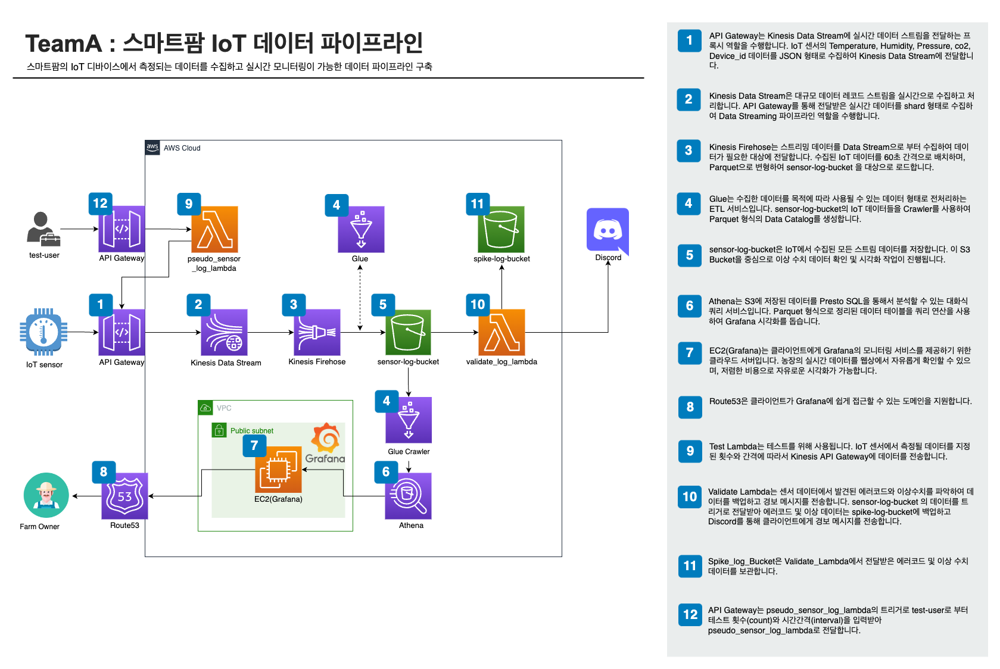</div>

## **실시간 데이터 수집/저장**
1. 수집/생성 Application으로부터 발생한 로그가 Kinesis Proxy 역할을 하는 [ApiGateway](#amazon-api-gateway) ```kinesis_api_gw```를 통해 **데이터 파이프라인으로 진입**합니다.
    <div style="text-align: center">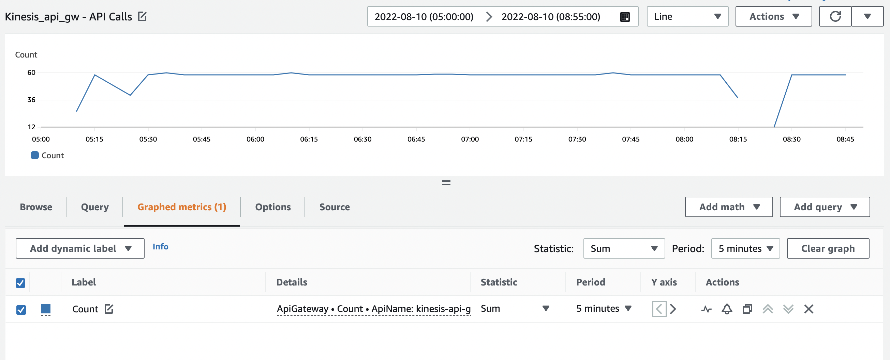</div>
2. 진입한 로그는 [Kinesis DataStream](#amazon-kinesis-datastream) 을 통해 **실시간으로 수집**됩니다.
    <div style="text-align: center">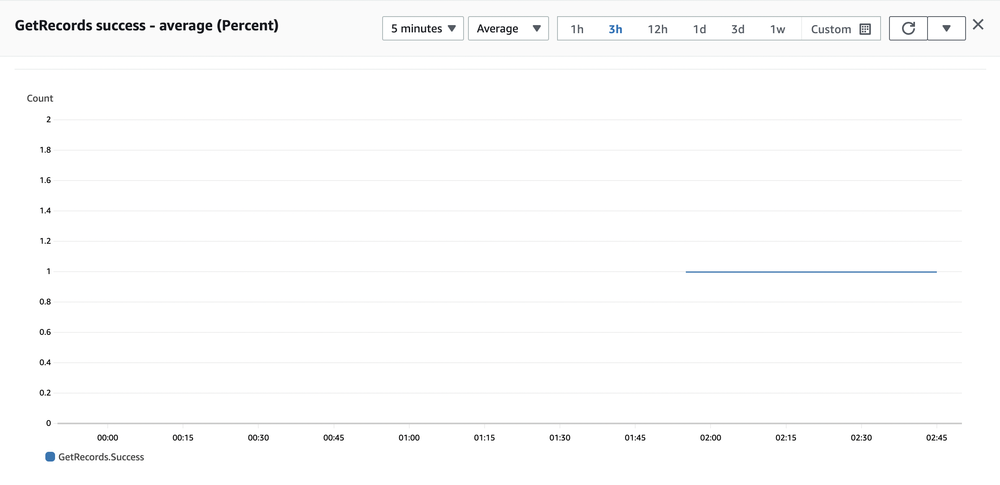</div>
3. Kinesis DataStream 에서 수집한 로그는 S3로 저장되기 전, [Kinesis Data Firehose](#amazon-kinesis-data-firehose) 를 이용하여 **ETL 작업**이 이루어집니다.
    - Kinesis Data Firehose는 **최소 1분 단위**로 데이터를 전송합니다.
    - ```JSON -> parquet```
        <div style="text-align: center">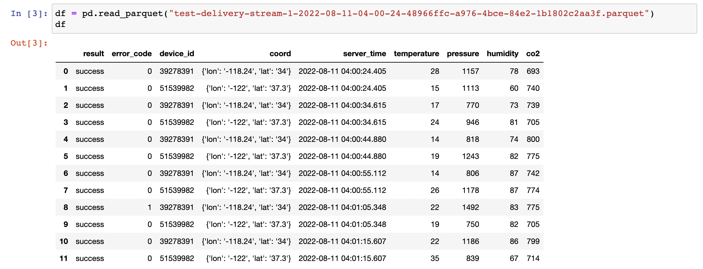</div>
    - 이때, Kinesis Data Firehose는 [AWS Glue Data Catalog](#aws-glue) 의 ```Database Table```을 참조합니다.
        - ```Database Table```은 **수집된 로그의 데이터 스키마 정보**를 가지고 있습니다.
4. 이후, 로그는 데이터 저장소인 [S3](#aws-s3) 인 ```sensor-log-bucket```에 저장됩니다.
    <div style="text-align: center">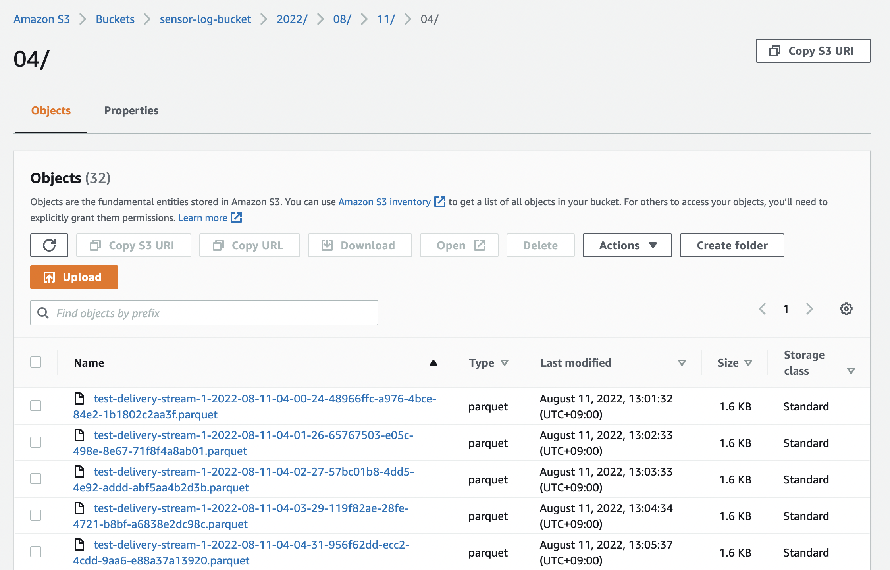</div>

## **Monitoring**
1. AWS Glue DataCatalog의 _Crawler_ 는 ```sensor-log-bucket``` 에 저장된 로그를 불러와 **_Table_ 을 생성**합니다.
    > 최초 한번만 실행합니다.
    <div style="text-align: center">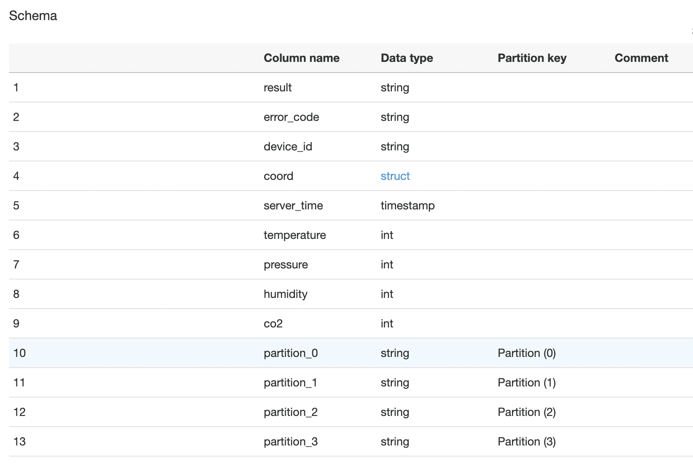</div>
2. [Amazon Athena](#amazon-athena) 가 생성된 _Table_ 을 참조하여 **query를 실행**합니다.
3. Monitoring Tool인 Grafana는 Athena와 연결되어 **시각화를 진행**합니다.
    - [Grafana](#grafana) 는 [**Amazon EC2**](#amazon-ec2) 를 활용하여 구동됩니다.
    - Grafana가 설치된 EC2의 _Endpoint_ 는 **Route53의 레코드**로 등록합니다.
4. 농장주는 **[Route53](#route53) 의 도메인**으로 접속하면 로그를 **모니터링**할 수 있습니다.
    <div style="text-align: center">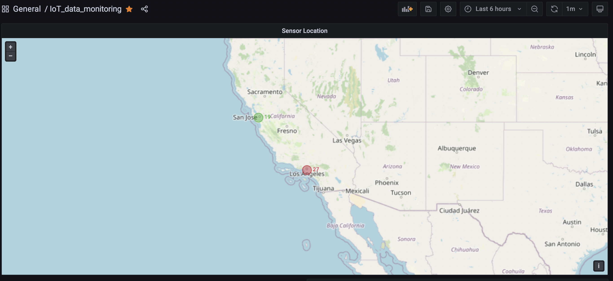</div>
    <div style="text-align: center">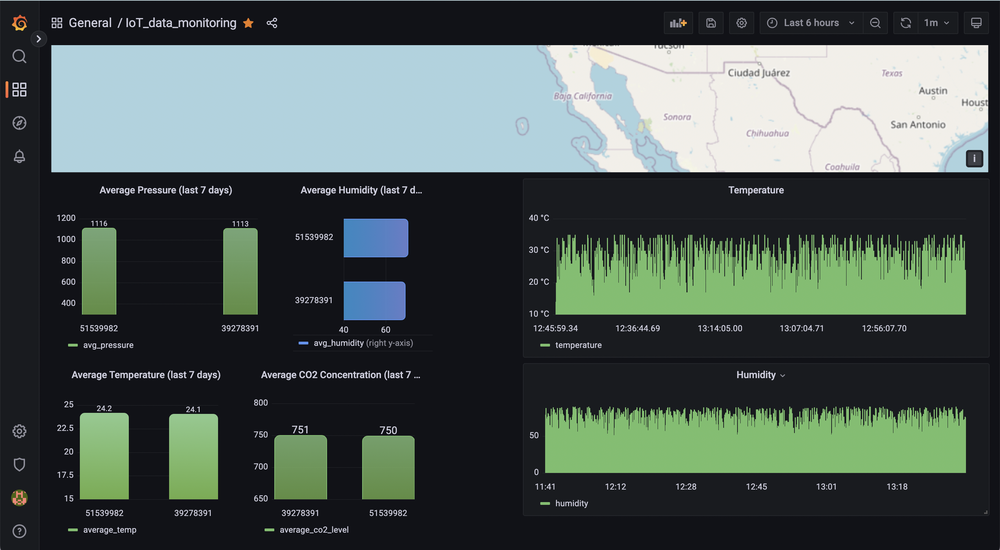</div>
## **이상 데이터 처리**
1. 로그 저장소 ```sensor-log-bucket```에 **데이터가 저장되면** [AWS Lambda](#aws-lambda) 가 실행됩니다.
    - 이때, AWS Lambda는 이상 데이터가 발생했는 지, 확인합니다.
        - 이상 데이터의 기준

            | 기준 | 예시 코드 |
            | --- | --- |
            |센서에 이상이 있는 가? | ```error_code = "1"```|
            |비정상적인 수치가 보이는 가? | ```temperature = "400"```|
        <div style="text-align: center">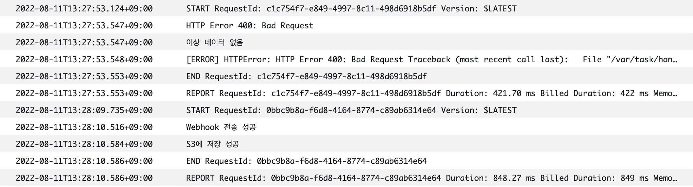</div>
2. _**이상 데이터가 발생했다면,**_
    - AWS Lambda의 로직으로 인해 **Discord Webhook을 통해 알림**을 보냅니다.
        <div style="text-align: center">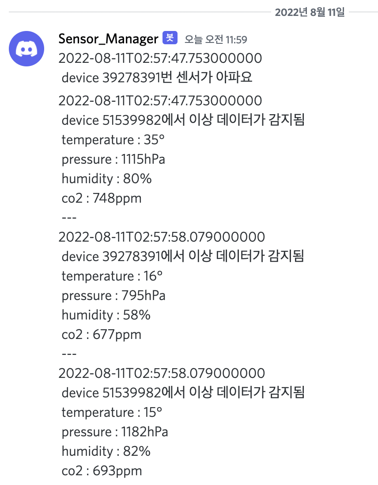</div>
    - 그 후, 이상 데이터만 선별하여 S3인 ```spike-log-bucket```에 **따로 저장**합니다.
        <div style="text-align: center">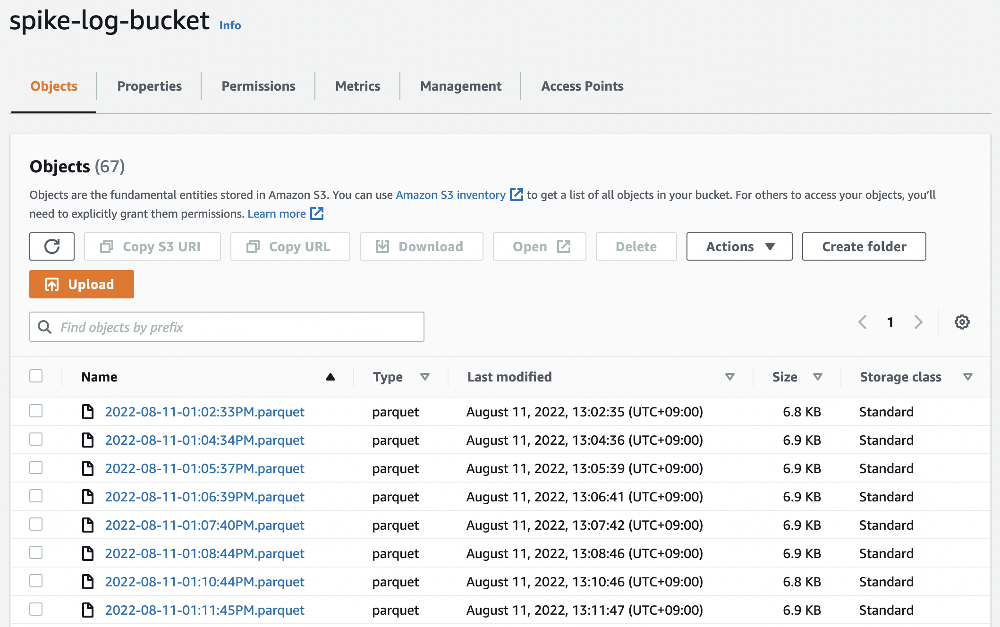</div>

## **Architecture Test**
### 가상의 로그 데이터 전송
1. AWS Lambda인 ```pseudo_sensor_log_lambda```의 API Gateway인 ```pseudo_api_gw```의 _Endpoint_ 에 요청 _body_ 를 담아, **POST 요청**을 보냅니다.
2. ```pseudo_api_gw```에 의해 실행된 ```pseudo_sensor_log_lambda```는 요청한 _body_ 에 따라 로직을 실행,
    - ```kinesis_api_gw```의 **_Endpoint_ 로 요청**을 보냅니다.
### _**HTTP Request 예시**_
```
POST / 
Content-Type : application/json
```
```
{
    "count" : 12,
    "interval" : 10
}
```
> **_Endpoint_ : ```pseudo_api_gw```의 _Endpoint_**
> | Name     | Type | Description   |
> |----------|:----:|---------------|
> | count    | int  | 전송할 데이터의 갯수 | 
> | interval | int  | 전송할 데이터의 간격 (초 단위)| 
### 실시간 로그를 보내어 테스트하고 싶다면?
해당 repository의 ```test.py``` 파일을 사용하여
```
$ python test.py
$ python3 test.py
```
위의 명령을 실행합니다.

## **아키텍처를 어떻게 실행하나요?**
<a href="https://github.com/cs-devops-bootcamp/devops-02-Final-TeamA-scenario1/blob/main/terraform/README.md"></a>
> 위의 이미지를 클릭하면 Terraform README.md로 이동합니다.

## **Resource**
> 왜 이 리소스를 선정했는 가?
### [Amazon API Gateway](https://docs.aws.amazon.com/ko_kr/apigateway/latest/developerguide/welcome.html)
- 엔드포인트를 활용하여 요청을 처리하기 때문에, IoT sensor Application 구현의 용이성, authorization token 등을 사용해서 보안도 좋습니다.
    - Kinesis Data Stream의 이름을 지정하여 데이터를 보내는 방법이 있는데, 이 방법은 같은 환경에서 개발되는 것이 아닌 외부 서비스가 연결되는 것이기 때문에 Python Boto3 모듈과 환경변수 등의 복잡도과 민감한 정보를 보호하기 위해 API Gateway를 사용하기로 결정했습니다.
- Kinesis Proxy로 활용하여 API Gateway Endpoint로 요청을 보내면 Kinesis Data Stream에 데이터가 바로 들어가도록 구현하였습니다.
### [Amazon Kinesis DataStream](https://docs.aws.amazon.com/ko_kr/streams/latest/dev/introduction.html)
- 병렬 처리가 가능하여 탄력성이 좋음. Kinesis Data Firehose, Kinesis Data Analytics와 같은 서비스 확장성이 좋습니다.
- AWS Key Management Service 서비스를 활용하여 Server-Side Encryption와 같은 기능으로 데이터 보안을 강화할 수 있습니다.
- Kinesis Data Stream은 일정 기간 데이터를 저장하기 때문에 내구성이 좋습니다.
- 아래의 그림과 같이 Shard를 추가하는 방식으로 확장성 또한 좋기 때문에 Kinesis Data Stream을 선택하였습니다.
- _Kinesis Data Streams High-Level Architecture_
    <div style="text-align: center;"> </div>
### [Amazon Kinesis Data Firehose](https://docs.aws.amazon.com/ko_kr/firehose/latest/dev/what-is-this-service.html)
- 데이터를 보내도록 데이터 생산자를 구성하면 지정한 대상으로 데이터를 자동으로 전송합니다. 전송 전에 Kinesis Data Firehose Firehose를 구성하여 데이터를 변환할 수도 있습니다.
- 파일 형식을 JSON에서 Apache Parquet 형식으로 변환하는 방법을 채택했는데, JSON은 데이터 타입에 대한 정보가 없는 반면, Parquet은 해당 정보를 포함하고 있고, Amazon Athena에서 쿼리 용량에 따라 과금이 되기 때문에 열 기반 데이터 형식인 Parquet으로 선택하여 비용 절감을 고려하였습니다.
### [AWS Glue](https://docs.aws.amazon.com/ko_kr/glue/latest/dg/what-is-glue.html)
- AWS Glue는 완전 관리형 추출, 변환 및 로드(ETL) 서비스로, 효율적인 비용으로 간단하게 여러 데이터 스토어 및 데이터 스트림 간에 원하는 데이터를 분류, 정리, 보강, 이동합니다.
- Crawler를 이용하여 자동으로 데이터 스키마 정보와 메타 데이터를 저장하는 기능이 있고, 이를 다른 서비스와의 넓은 확장성으로 Amazon Athena와도 높은 호환성을 자랑합니다.
- AWS Glue는 서버리스이므로 설정하거나 관리할 인프라가 없습니다.
- 이 아키텍처에서는 Crawling을 한번만 하여 Table을 참조하기만 하면 되기 때문에 비용 효율성도 고려하여 선정했습니다.

### [Amazon Athena](https://docs.aws.amazon.com/ko_kr/athena/latest/ug/what-is.html)
- Athena는 서버리스 서비스이므로 설정하거나 관리할 인프라가 없으며 실행한 쿼리에 대해서만 비용을 지불하면 됩니다. Athena는 자동으로 확장되어 쿼리를 병렬로 실행하여 대규모 데이터 집합과 복잡한 쿼리에서도 빠르게 결과를 얻을 수 있습니다.
- Amazon Athena는 Amazon S3를 기본 데이터 스토어로 사용하여 데이터 가용성과 내구성이 매우 우수합니다.
- Grafana에서 Athena Plugin으로 인해 연결성과 호환성 또한 좋습니다.
- S3 Select라는 서비스도 고려했지만, S3 Object 단위로 작동하는 것이 이 아키텍처와는 맞지 않아 선택하지 않았습니다.
### [Amazon EC2](https://docs.aws.amazon.com/ko_kr/AWSEC2/latest/UserGuide/concepts.html)
- 하드웨어에 선투자할 필요가 없어 더 빠르게 애플리케이션을 개발하고 배포할 수 있습니다.
- Amazon EC2에서는 확장 또는 축소를 통해 요구 사항 변경 또는 사용량 스파이크를 처리할 수 있으므로 트래픽을 예측할 필요성이 줄어듭니다.
- Grafana를 로컬환경이 아닌 클라우드 상에서 구동하기 위해 사용했습니다. 
- AWS managed grafana 서비스도 있는데, 라이센스 발급에만 9$인 반면, EC2의 T2 Nano는 한달에 7$ 예상되기 때문에 EC2로 선정하였습니다.
### [Amazon Route53](https://docs.aws.amazon.com/ko_kr/Route53/latest/DeveloperGuide/Welcome.html)
- 가용성과 확장성이 뛰어난 DNS(Domain Name System) 웹 서비스입니다.
- Route 53을 사용하여 세 가지 주요 기능,
    - 즉, 도메인 등록, DNS 라우팅, 상태 확인을 조합하여 실행할 수 있습니다.
- Grafana를 EC2에서 구동하도록 설계했는데, 이를 Client의 용이한 접근성을 위해 선택하였습니다.
### [Amazon S3](https://docs.aws.amazon.com/ko_kr/AmazonS3/latest/userguide/Welcome.html)
- Amazon Simple Storage Service(Amazon S3)는 높은 확장성, 데이터 가용성, 보안 및 성능을 제공하는 객체 스토리지 서비스입니다.
- Intelligent-Tiering 기능으로 오래된 데이터들을 각각 스토리지 클래스를 분리하여 저장할 수 있기 때문에 스토리지 비용을 절감할 수 있어, S3를 선정하였습니다.
### [AWS Lambda](https://docs.aws.amazon.com/ko_kr/lambda/latest/dg/welcome.html)
- Lambda는 서버를 프로비저닝하거나 관리하지 않고도 코드를 실행할 수 있게 해주는 컴퓨팅 서비스입니다.
-  Lambda는 필요 시에만 함수를 실행하며, 일일 몇 개의 요청에서 초당 수천 개의 요청까지 자동으로 확장이 가능합니다. 사용한 컴퓨팅 시간만큼만 비용을 지불하고, 코드가 실행되지 않을 때는 요금이 부과되지 않습니다.
- Lambda API를 사용하여 Lambda 함수를 호출하거나, Lambda가 다른 AWS 서비스의 이벤트에 응답하여 함수를 실행할 수 있습니다.
### [Grafana](https://grafana.com/docs/grafana/latest/introduction/)
- 오픈소스이며, 인프라 관리 비용도 EC2 T2 Nano를 사용하여 저렴합니다.
- 다양한 시각화 옵션이 있고, Dashboard를 Grafana CLI를 사용하여 IaC화가 가능합니다.