# Terraform을 활용한 아키텍쳐 IaC화 (수정 중)

<a href="https://www.terraform.io/"></a>

## 주요 목표
- Terraform를 사용해서 스마트팜 IoT 센서 데이터 서비스 구축
- 리소스를 일일이 AWS Console 상에서 만들어야 하는 번거러움을 줄여주기 위한 Reusability 확보

---

## Terraform 파일 명세

### `main.tf`
- AWS 리소스를 사용하기 위한 provider에 관한 정보를 담고 있는 .tf 파일입니다.

```terraform
terraform {
  required_providers {
    aws = {
      source  = "hashicorp/aws"
      version = "~> 4.16.0"
    }
  }
  required_version = ">= 1.1.0"
}

```

### `pseudo-api-service.tf`

<div style="text-align: center;">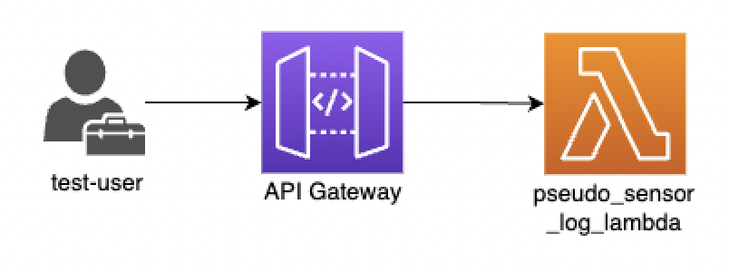</div>

해당 .tf 파일은 다음과 같은 리소스들을 생성합니다.
- 실시간 센서 데이터를 모방하는 `pseudo-sensor-log-lambda` 함수
- `pseudo-sensor-log-lamdba` 함수를 트리거 하기 위한 API Gateway


### `kinesis-service.tf`

<div style="text-align: center;">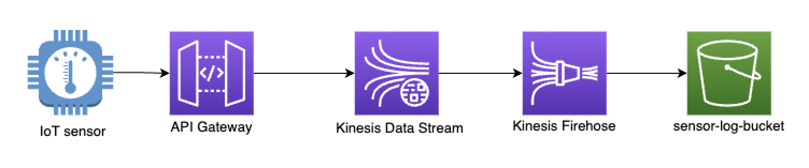</div>

AWS에서 제공하는 매니지드 데이터 스트리밍 서비스인 Amazon Kinesis를 활용하여 파이프라인 구축에 필요한 리소스들을 생성하는 .tf 파일입니다.
- 데이터 스트리밍을 가능하게 해주는 Kinesis Data Stream
- Kinesis Data Stream을 통해 전달되는 데이터에 대한 ETL 작업을 수행하는 Kinesis Firehose Delivery Stream
- ETL 작업이 완료된 데이터를 보관하는 S3 버킷


### `validate-log-service.tf`
<div style="text-align: center;">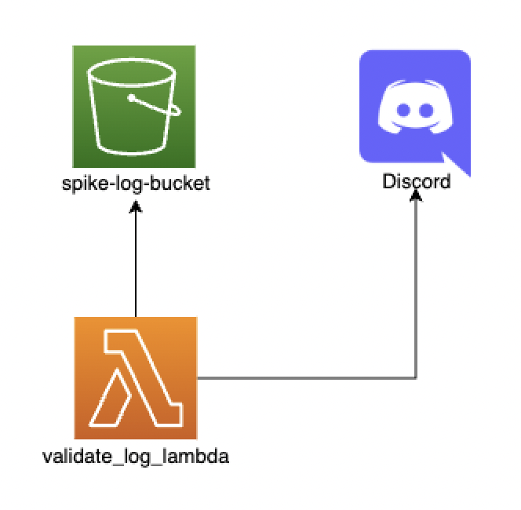</div>

정제되어 S3 버킷에 저장된 센서로그에 대한 무결성 검증을 진행하는 서비스를 구축하는 .tf 파일입니다.
- `validate_log_lambda` 함수에서 로그 무결성 검증을 실행하며 해당 검증에 실패할 경우
  - `spike-log-bucket`에 이상데이터를 저장합니다.
  - 지정된 Discord Webhook 채널에 해당 사항을 공지합니다.


### `monitoring-service.tf`

<div style="text-align: center;">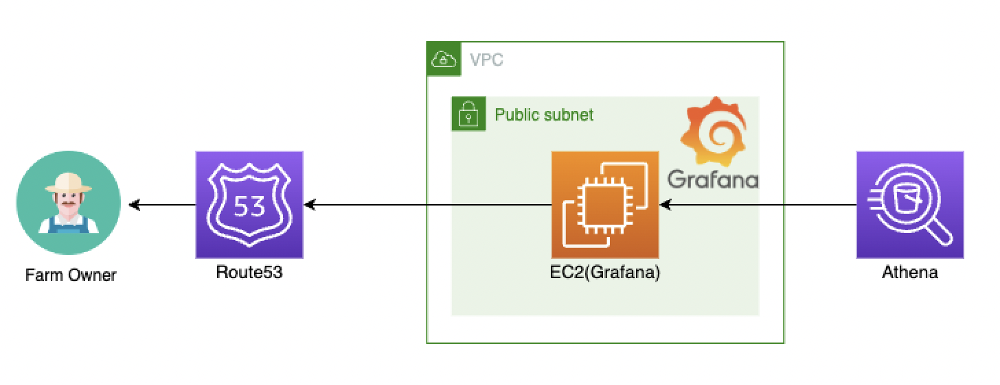</div>

- 모니터링 서비스인 Grafana를 구동하기 위한 EC2 서버를 생성합니다.
- 해당 .tf 파일은 인스턴스가 위치하는 VPC, Subnet, Security Group 등과 같은 리소스들에 대한 정의를 포함하고 있습니다.
- Athena에서 쿼리할 데이터를 미리 준비해주는 Crawler에 대한 정의 또한 포함합니다.
- Route53에서 EC2 인스턴스의 IP 및 DNS 주소를 사용자 도메인의 A-Record로 생성합니다.


### `variables.tf`
- 리소스들이 활용할 수 있는 변수들에 대한 선언을 담고 있는 .tf 파일입니다.


## Terraform 스크립트 실행 및 테스트 순서

---
### **인프라 구축과 알림 시스템 확인**

- [AWS CLI](https://aws.amazon.com/ko/cli/)를 로컬 환경에 설치합니다. 설치 방법은 해당 링크에 제공되어 있습니다.
- 현재 리포지토리를 fork한 후 로컬 환경에서 `git clone`을 진행합니다.
- 기존에 소유하고 있는 AWS 계정에서 Access Key/Secret Key 를 발급받은 후, [AWS CLI](https://aws.amazon.com/ko/cli/)에 다음과 같은 명령어를 입력한 후 크레덴셜을 기입합니다.
  ```aws configure```
- Terraform 리소스를 사용해야 함으로 [Terraform CLI](https://learn.hashicorp.com/tutorials/terraform/install-cli)를 설치합니다.
- 터미널에서 클론해 놓은 디렉터리로 이동하여 `cd terraform`으로 디렉터리를 이동합니다.
- 먼저 `terraform` 디렉터리를 `terraform init`을 통해 초기화합니다.
- `main.tf` 기본 설정 상으로는 리소스들이 서울 리전(ap-northeast-2)에 생성됩니다. 이를 수정하고 싶다면 다음과 같은 형식으로 변경사항을 저장합니다.

  ```ruby
  # main.tf
  provider "aws" {
    region  = "YOUR_PREFERRED_REGION"
  }
  ```
- 이 프로젝트는 사용자가 AWS Route53에 등록되어 있는 도메인이 있다고 가정하고 만들어졌습니다. 만약 그렇지 않은 경우에는 `monitoring-service.tf` 파일의
  ```ruby
  # monitoring-service.tf
  data "aws_route53_zone" "hosted-zone" {
  name         = "${var.domain_name}"
  }

  resource "aws_route53_record" "www" {
    zone_id = data.aws_route53_zone.hosted-zone.zone_id
    name    = "www.${var.domain_name}"
    type    = "A"
    ttl     = 300
    records = ["${aws_instance.grafana-ec2-final.public_ip}"]
  }
  ```
  와 `variables.tf`의 다음 부분을 주석처리합니다.
  ```ruby
  # variables.tf
  variable "domain_name" {
    type = string
  }
  ```
- `terraform plan`을 통한 리소스 플래닝을 진행합니다. 이때 콘솔에 사용자의 AWS Account ID (12자리)를 입력해야 합니다.
  - Route53 상의 도메인을 소유한 경우에는 이 또한 입력해야 합니다.
- `terraform plan`이 정상적으로 실행되었다면 `terraform apply`를 통해 리소스를 실제로 생성합니다. `plan`과 마찬가지로 Account ID를 입력해야 합니다.
- 리소스들이 정상적으로 생성되었다면 다음과 같이 `pseudo-api-gw-endpoint`가 output으로 콘솔상에 나타나게 됩니다.
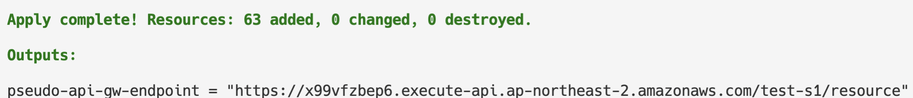

- 생성된 엔드포인트에 [Postman](https://www.postman.com/)과 같은 API 플랫폼을 활용하여 POST 요청을 진행합니다. 이때 요청 페이로드는 다음과 같은 json 형태로 작성합니다.
   
  <div style="text-align: left;">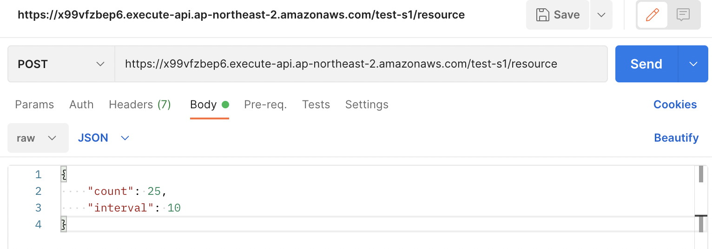</div>

- 약 1분 마다 이상 데이터가 지정된 Discord Webhook URL을 통하여 전송됩니다.
  <div style="text-align: left;">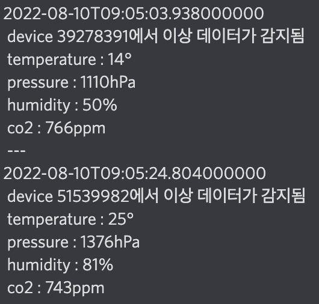</div>

---
### **데이터 파이프라인 점검 및 모니터링 시스템 구축**

- EC2 인스턴스 상에 구성되는 그라파나에서 실시간 데이터를 구성하기 위해서 Athena를 중점적으로 사용합니다. Athena Engine을 사용하기 위해선 먼저 Glue 상의 table이 구성되어야 하는데, 이를 위해 Terraform으로 구성한 Glue Crawler인 `parquet-sensor-data-crawler`를 활용합니다.
  <div style="text-align: left;">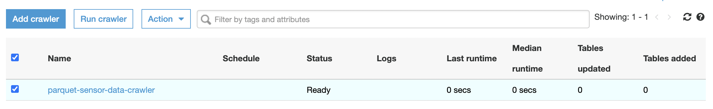</div>
  
- 위 이미지와 같은 Glue 페이지에서 Crawler를 실행하면 새로운 테이블이 Glue 상에 생성됩니다.

  <div style="text-align: left;">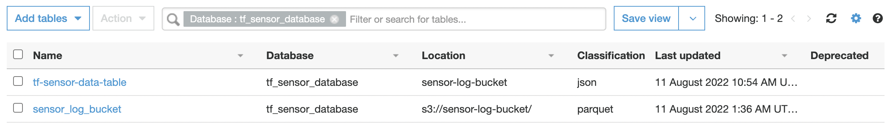</div>

- Terraform 구성상 Glue의 테이블들을 참조하여 Athena 쿼리를 실행할 수 있습니다. Athena의 Query Editor 페이지에 접속하여 다음과 같은 속성 값으로 설정을 진행합니다.
  - Data Source: `glue-data-catalog`
  - Database: `tf_sensor_database`
  - Workgroup: `test-workgruop`

  이후 간단한 쿼리문을 실행하면 센서 로그에 관한 정보를 가져올 수 있습니다.
  ```sql
  /* 총 로그 수*/
  SELECT COUNT(*) FROM sensor_log_bucket
  /* 지난 7일간 센서별 평균 온도 */
  SELECT device_id, AVG(temperature) AS average_temp from sensor_log_bucket WHERE DATE(server_time) >= DATE_ADD('day', -7, current_date) GROUP BY device_id;
  ```

  <div style="text-align: left;">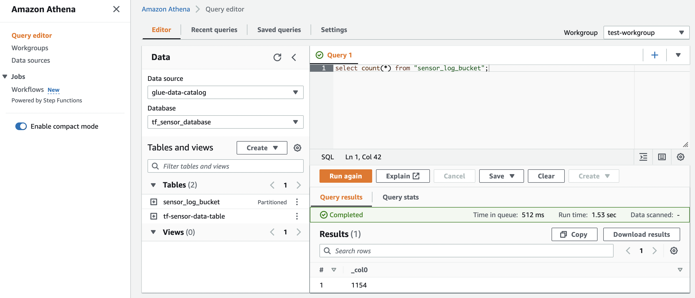</div>

- 모니터링 서비스인 Grafana에 접속하기 위해서는 터미널 상에 출력되는 다음 두 값들을 참조합니다.
  <div style="text-align: left;">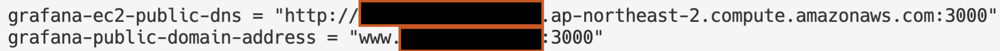</div>

    - Route53 상 등록된 도메인이 없는 경우에는 `grafana-ec2-public-dns`의 주소로 접속합니다.
    - 도메인을 입력했다면 `grafana-public-domain-address`의 주소로 접속합니다.

  해당 링크에 정상적으로 접속했다면 다음과 같은 화면이 나타나게 됩니다.
  <div style="text-align: left;">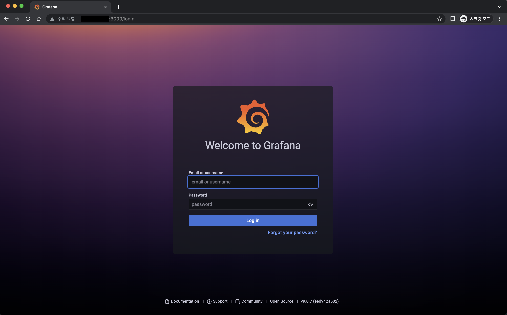</div>

  Grafana의 초기 설정 ID 및 Password는 `admin`으로 동일하며 최초 접속시 비밀번호 변경을 요구합니다. 이때 사용자가 원하는 비밀번호 형식으로 구성합니다.

